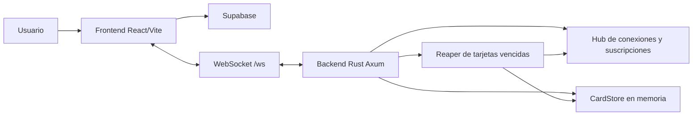
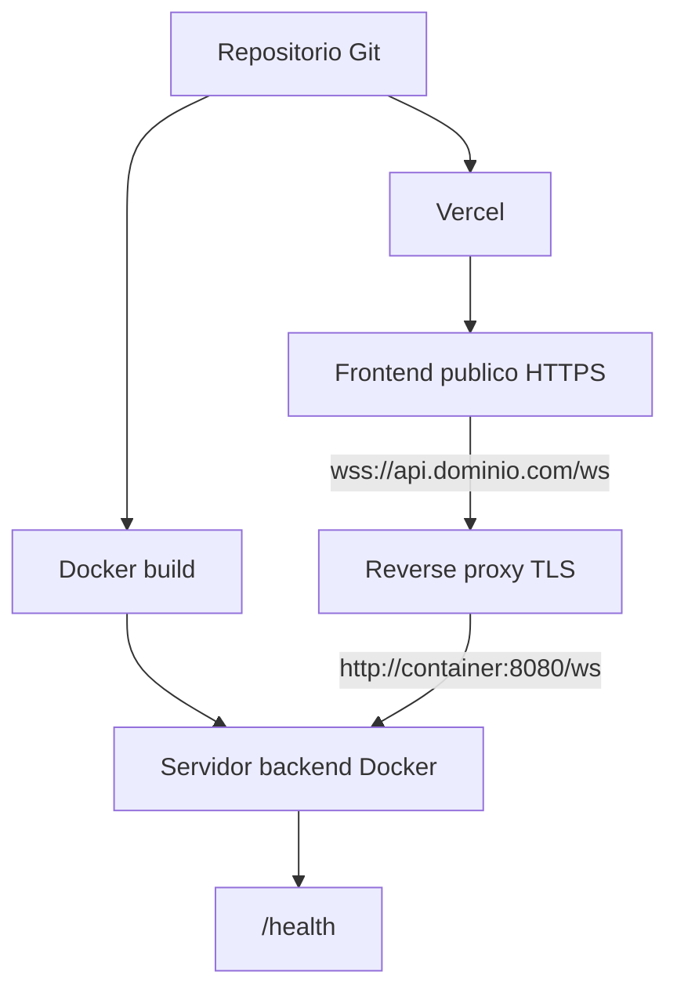
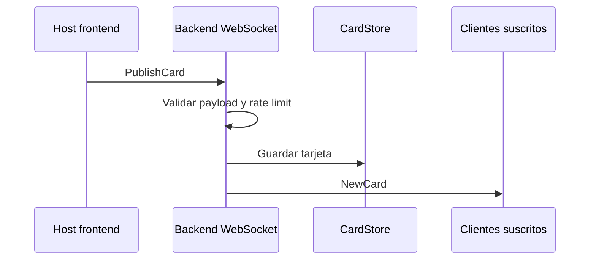
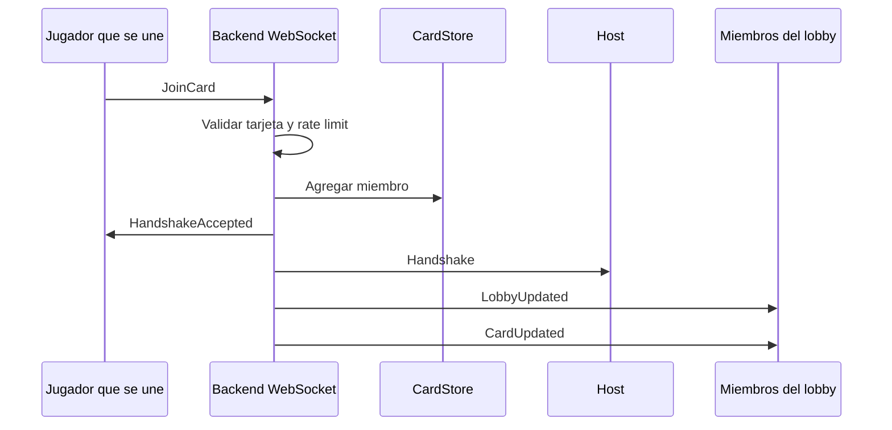
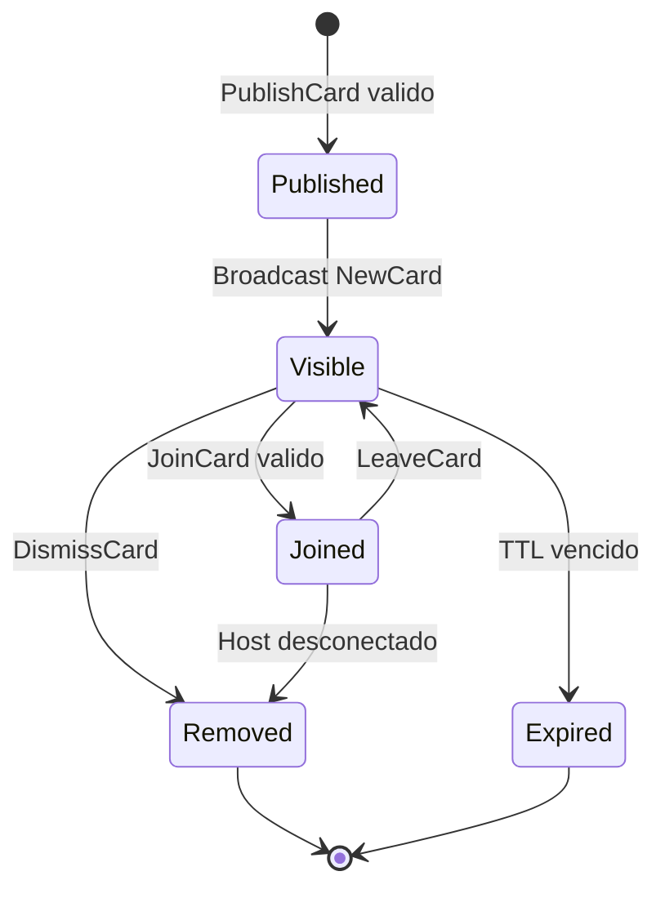
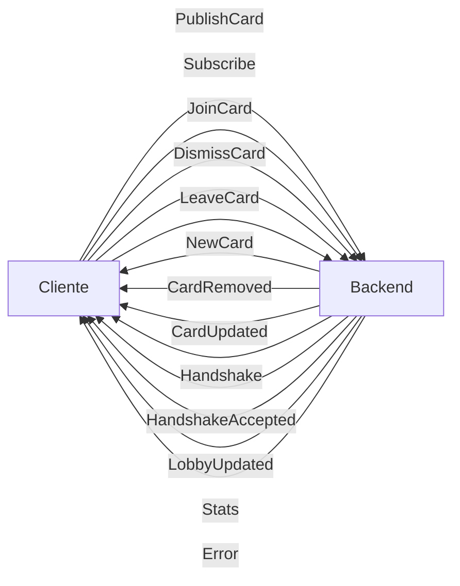

# Diagramas

Los diagramas usan Mermaid y se pueden visualizar en GitHub, VS Code o cualquier
visor compatible.

## Arquitectura general

## Despliegue

## Flujo de publicacion

## Flujo de unirse a lobby

## Ciclo de vida de una tarjeta

## Mensajes del protocolo

